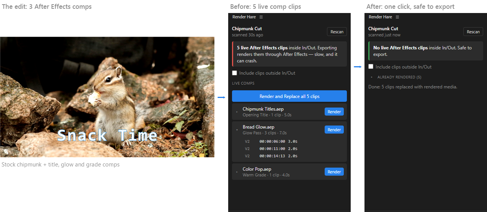

# Render Hare

**One-click Render and Replace for After Effects Dynamic Link clips in Premiere Pro.**



If you're like me and keep running into After Effects Dynamic Link comps that
never got rendered and replaced, crashing your projects or leaving an export
stuck at 37% for hours, this is for you.

Render Hare is a small Premiere Pro panel that finds every live After Effects
comp in your sequence and runs Premiere's own **Render and Replace** on them
in one click, so your export reads finished video files instead of asking
After Effects to render every frame live.

*Made by **Code Hare**. If you like it, please check out my other projects,
like [ScriptHare](https://scripthare.com).*

---

## What it does

- **Finds every After Effects comp clip** in the active sequence, including
  ones inside nested sequences, grouped by comp.
- **Warns you before you export**: a red banner while live comps sit inside
  the sequence's In/Out, green when you're safe to export.
- **Render / Render and Replace all**: selects those clips and opens
  Premiere's Render and Replace dialog with your usual settings. Click OK;
  the list refreshes by itself when the render finishes, however long After
  Effects takes.
- **Restore**: puts rendered clips back to live comps (Premiere's Restore
  Unrendered) when you need to tweak something in After Effects.
- **Click any clip** in the list to select it and jump the playhead there.
- Handles comps cut into many pieces: touching pieces of one comp render into
  a single file.

Render Hare doesn't render anything itself. It drives Premiere's built-in
Render and Replace, so the output, handles, effects and Restore Unrendered all
behave exactly as they do from the Clip menu.

## Requirements

- **Adobe Premiere Pro 2026 (26.0) or newer**
- Windows 10/11, or macOS (**beta**, see below)
- After Effects installed (it does the actual rendering, as always with Dynamic Link)

Older Premiere versions aren't supported. If you need one, open an issue.

## Install

1. Download `RenderHare-<version>.zxp` from the
   [Releases](../../releases) page.
2. Install it with **one** of:
   - the installer script from the same release, placed next to the `.zxp`:
     **`Install-RenderHare.bat`** (Windows) or **`Install-RenderHare.command`**
     (macOS). These run Adobe's own installer, which comes with Creative Cloud;
   - or any ZXP installer app, e.g. [ZXP Installer by aescripts](https://aescripts.com/learn/zxp-installer/).

   On a Mac, if double-clicking the `.command` file is refused, open Terminal
   in that folder and run `sh Install-RenderHare.command`.
3. Restart Premiere Pro, then open **Window → Extensions → Render Hare**.

## Using it

1. Open the sequence you're about to export. Render Hare scans it when the
   panel opens (press **Rescan** after edits).
2. Press **Render and Replace all**, or **Render** next to a single comp.
3. Premiere's Render and Replace dialog opens. Check the settings and click
   **OK**.
4. When it finishes, the list refreshes. Green banner = export away.

Tick **Include clips outside In/Out** if you export the whole sequence rather
than In to Out.

## Languages

Render Hare works whatever language Premiere's UI is in. It finds the menu
commands using Adobe's own translations for all 10 languages Premiere 2026
ships:

English · Deutsch · Español · Français · Italiano · 日本語 · 한국어 ·
Português (Brasil) · Русский · 简体中文

(The panel's own text is English for now.)

## macOS (beta)

The Mac version is written but hasn't been tested on a real Mac yet.
Feedback is very welcome.

On a Mac, Render Hare opens the menu command through macOS GUI scripting, so
the first time you press Render macOS asks for permission. Allow it under
**System Settings → Privacy & Security → Accessibility** (turn on
*Adobe Premiere Pro*), then press Render again. Until then, the clips are
still selected for you; just choose **Clip → Render and Replace…** yourself.

**Blank panel on a Mac?** Release packages are signed on Windows, and Adobe
has a [known issue](https://github.com/Adobe-CEP/CEP-Resources/blob/master/ZXPSignCMD/KnownIssue2024.md)
where those signatures don't verify on macOS. Adobe's workaround is to allow
unsigned extensions: run `defaults write com.adobe.CSXS.12 PlayerDebugMode 1`
in Terminal, then restart Premiere.

## How it works

Premiere's scripting API can't replace a Dynamic Link clip's media directly
(Premiere refuses both changing the media path and attaching a proxy for
these items), so Render Hare:

1. scans the sequence with ExtendScript and selects the clips you picked;
2. triggers Premiere's real **Clip → Render and Replace…** menu command:
   on Windows by sending the menu command to Premiere's window, on macOS
   through System Events;
3. watches for Premiere's dialogs to close, then rescans.

Nothing leaves your machine: the panel opens no network connections and
sends no analytics. The only link is the scripthare.com link at the bottom.

## Troubleshooting

- **"Premiere didn't open the dialog"**: the clips are still selected; choose
  **Clip → Render and Replace…** yourself, and please open an issue with your
  Premiere version and language.
- **"The menu item wasn't found"**: your Premiere version or language uses a
  label Render Hare doesn't know yet. Please open an issue.
- **The scan takes a moment**: very large timelines (thousands of clips)
  take a second or two, and Premiere pauses briefly while it reads them.
- **Media Encoder pauses while rendering**: Premiere seems to pause Adobe
  Media Encoder's queue while Render and Replace transcodes; it resumes on
  its own afterwards.

## Known limitations

- Scans **video tracks** (AE comps usually live there). Audio-only Dynamic
  Link clips aren't listed.
- It can't stop Premiere's own **File → Export**; glance at the panel before
  you export.

## Building from source

```
extension/            the CEP extension (what the .zxp contains)
  CSXS/manifest.xml   Premiere 26+, CEP 12
  index.html          panel UI
  js/panel.js         panel logic
  js/menu.js          runs the platform menu helper
  jsx/renderhare.jsx  ExtendScript: scan + select (one global: RenderHare)
  tools/              premiere-menu.ps1 (Windows), premiere-menu-mac.applescript (macOS)
  locales/            Render and Replace / Restore Unrendered labels, all languages
scripts/              dev install, debug mode, ZXP build/sign
install/              end-user installer scripts (wrap Adobe's UPIA)
```

- **Develop:** run `scripts/enable-debug-mode` (allows unsigned extensions),
  then `scripts/install-dev` (links `extension/` into Premiere's extensions
  folder), and restart Premiere. The panel's DevTools are at
  `http://localhost:8092` while it's open.
- **Package:** `scripts/build-zxp.ps1` stages `extension/` (minus dev files)
  and signs it with Adobe's `ZXPSignCmd` into `dist/RenderHare-<version>.zxp`.

## License

[MIT](LICENSE) © 2026 Code Hare

---

*Render Hare is an independent project by Code Hare, not affiliated with or endorsed by Adobe. Adobe, Premiere Pro and After
Effects are trademarks of Adobe Inc.*
